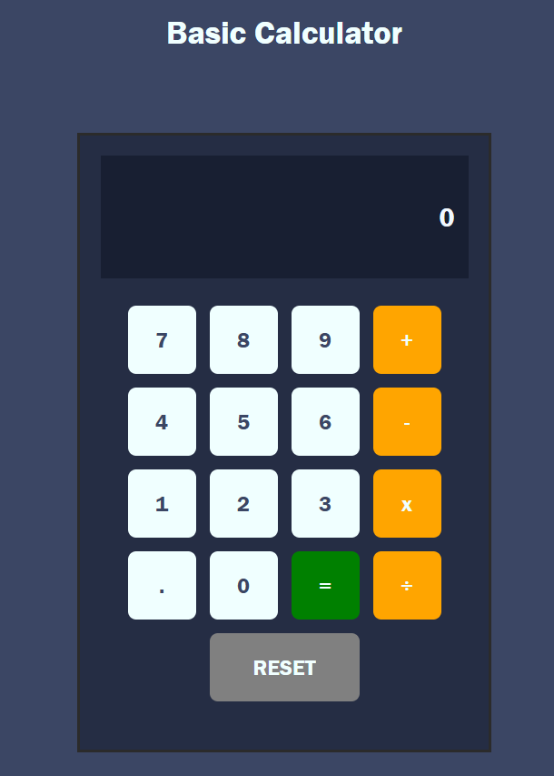
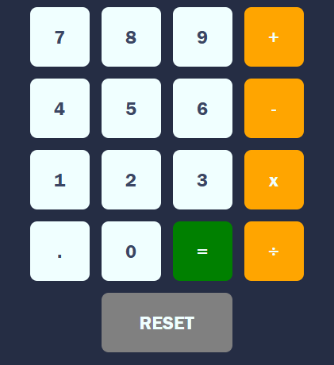
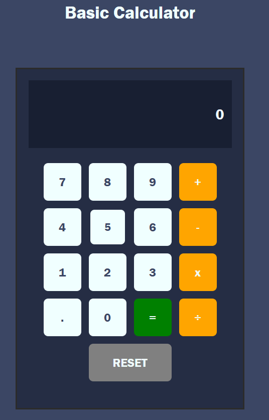

# Project-2---Basic Calculator

In this section, you will include one or two paragraphs providing an overview of your project. Essentially, this part is your sales pitch. At this stage, you should have a name for your project so use it! Don’t introduce the project as a Portfolio project for the diploma. In this section, describe what the project hopes to accomplish, who it is intended to target and how it will be useful to the target audience.

Basic Calculator is a website to create arithmetic operations which is targeted towards day to day users that need to calculate huge numbers which this website provides. This has been created with a size of a real calculator and therefore makes the website responsive for every device.

## Features

- **Display Screen**

  - Inside the calculator is a box which acts like the screen of an actual calculator where the numbers are inputted

    

- **Buttons Keypad**

  - At the bottom we have the buttons that is clicked to make the calculation.
    

  - I have added an animation in each button to hint the user that a button has been clicked especially when it is an operation that is clicked which is not shown on the screen unlike the numbers that appear when they are clicked.

    

  - the buttons are styled due to its functions: - the standard numbers are styled with white background - the arithmetic operations are in one category with an orange background - the equal and the reset buttons are unique with its own function hence they are given their own background as the reset resets the screen and operations and the equal button prints the result of the operation which arent shared with other buttons

## Testing

- Overall the calculator performs well and meets its functional requirements. It is responsive, accessible, and compatible with modern browsers. Users are able to complete basic calculations easily.

- Basic Arithmetic Operations: Users can successfully perform addition, subtraction, multiplication, and division.

- Clear and Delete Functions: The calculator includes clear functionality to reset the calculation, as well as the ability to delete individual digits or characters.

- Responsive Design: The interface adjusts seamlessly across various screen sizes, including mobile phones, tablets, and desktops. The layout remains clean and usable regardless of screen
- Operator Click Before Number Input: If a user clicks an arithmetic operator (e.g., +, -, ×, or ÷) before entering a number, the calculator is unable to complete the full operation chain properly resulting in an incomplete or incorrect calculation flow.

### Validator Testing

- HTML
  - No errors or warnings were returned when passing through the official [W3C validator](https://validator.w3.org/nu/?doc=https%3A%2F%2Fcode-institute-org.github.io%2Flove-maths%2F#textarea)
- CSS
  - No errors or warnings were found when passing through the official [(Jigsaw) validator](https://jigsaw.w3.org/css-validator/#validate_by_input)
- JavaScript
  - No errors were found when passing through the official [Jshint validator](https://jshint.com/)
    - The following metrics were returned:
    - There is only one function in this file.
    - It takes no arguments.
    - This function contains 49 statements.
    - Cyclomatic complexity number for this function is 18.

### Unfixed Bugs

You will need to mention unfixed bugs and why they were not fixed. This section should include shortcomings of the frameworks or technologies used. Although time can be a big variable to consider, paucity of time and difficulty understanding implementation is not a valid reason to leave bugs unfixed.

A bug which was unfixed was in using negative numbers for the calulcation where the user would click the subtraction operator. This is an issue which cannot be calculated as the code in the subtraction button is used conditionally which sets the second operator for the caclulator causing a clash if it was used for negative numbers.
Fixing this bug was a huge challenge for me and it required a lot of effort which allowed me to struggle in solving it without modifying the previous code. This was because the other code was dependant on each feature which explains the abundant conditional statements causing a puzzle to solve.

## Deployment

- The site was deployed to GitHub pages. The steps to deploy are as follows:
  - In the GitHub repository, navigate to the Settings tab
  - From the source section drop-down, select the Deploy from a branch
  - From the Branch drop-down, select the main drop-down and next to it, select the root drop-down
  - Once the everything has been selected, the page will be automatically refreshed with a detailed ribbon display to indicate the successful deployment.

The live link can be found here - https://hamza789987.github.io/Project-2-Basic-Calculator/

## Credits

The main credits that i gave was the suitable background colour which i saw from the internet specifically this picture.

I have used the same background colours that was used by finding their CSS file in the github link except for the buttons where i used my own and colour coded the buttons for my calculator

I also give credit to stack overflow as i researched in doing the animation of the clicked buttons whilst understanding it and then being able to code it out myself
